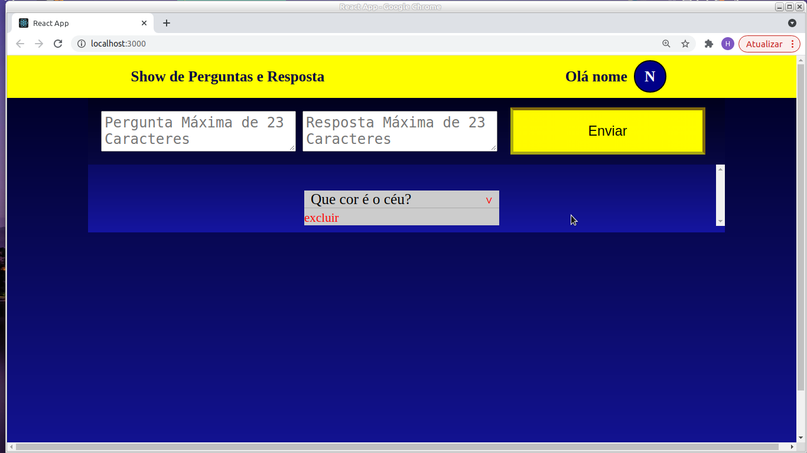

<h1><strong>Bootstrap Accordion Rebuild</strong></h1>

<h2>Proposed Challenge:</h2>

The proposed objective was to recreate Accordion with React, the Implementation should refer to Bootstrap, based on that I decided to create a web application of "Questions and Answers".

 

<h3>Home screen</h3>

<i>To access the application you must register and then login.</i>

 

<h3>Register</h3>

<i>The Register will be stored in LocalStorage.</i>

 

<h3>Login</h3>

<i>After registration, just access.</i>

 

<h3>Creating the Question</h3>

<i>Questions and Answers must be a maximum of 23 characters.</i>

 

<h3>Created Questions and Answers<h3>

<i>After creating and clicking Submit, the question will appear next, and the answer will only appear by clicking on the question itself.</i>

 

<h3>Response</h3>

<i>The answer will be hidden so that the participant of the game will not see the answer before.</i>

 

<h3>Conclusion</h3>

<i>You can add as many questions as you want, and you can also delete them by clicking on the Delete option (located in the lower left corner of the question). At various times you will notice the implementation of Accordion, from the initial screen when opening and closing both the Register and Login, when opening and closing the questions and when exiting by clicking on the icon with the initial letter of your name.</i>

 
 

<h2>Technologies</h2>
- React.JS
- JavaScript
- Css
- Styled-Components

